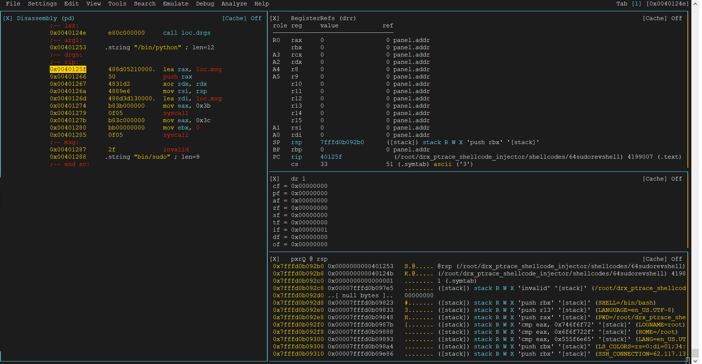
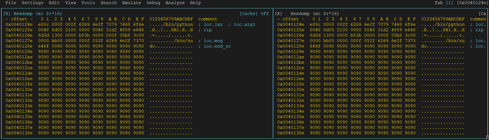
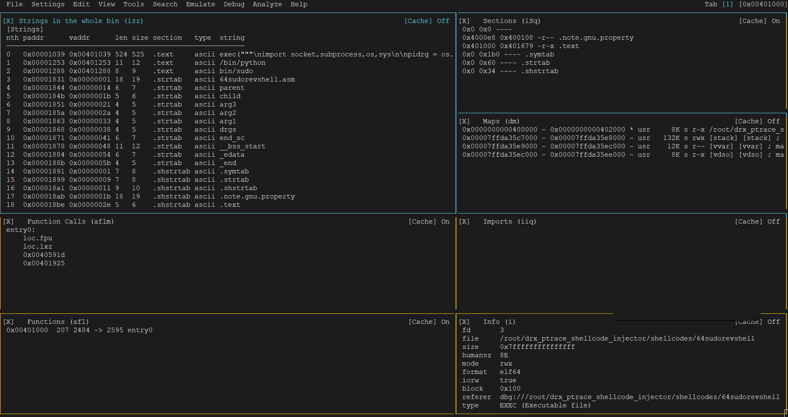

# dreg-r2panels
my radare2 r2panels

* just copy my r2panels to ~/.local/share/radare2/.r2panels
* open (v)  mode in radare2, click in TAB (upper right) to create three tabs
* select in each tab one panel: go to file -> load layout -> saved layout 

Now you have three tabs in the same session like:

for 32bit process use dreg32, for 64 bits process use dreg64:

hex (two hexdumps):

misc:

